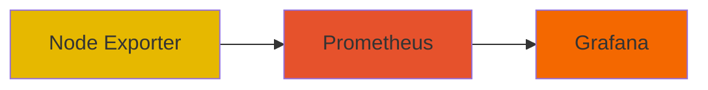
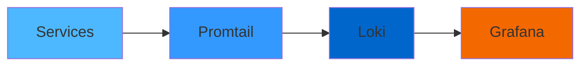

# Complete Monitoring Stack 🚀

A comprehensive monitoring solution using CNCF tools for both metrics and logs monitoring. This stack provides a complete observability solution for your applications and infrastructure.

## Table of Contents 📋

- [Architecture](#-architecture)
- [Components](#-components)
- [Prerequisites](#-prerequisites)
- [Getting Started](#-getting-started)
- [Services Monitoring](#-services-monitoring)
- [Configuration](#%EF%B8%8F-configuration)
- [Access UIs](#-access-uis)
- [Security](#-security)
- [License](#-license)

## 🏗 Architecture

This monitoring stack consists of two main pillars:

### Metrics Monitoring


### Logs Monitoring


## 🔧 Components

| Component | Version | Description |
|-----------|---------|-------------|
| Prometheus | v2.47.2 | Time series database for metrics |
| Node Exporter | v1.7.0 | System metrics exporter |
| Loki | v3.5.0 | Log aggregation system |
| Promtail | v3.5.0 | Log collector and forwarder |
| Grafana | v11.6.1 | Visualization and analytics platform |

## ✅ Prerequisites

- Docker Engine (latest version)
- Docker Compose v2.x
- At least 4GB of RAM
- 10GB of free disk space

## 🚀 Getting Started

1. Clone the repository:
```bash
git clone https://github.com/deepraj1729/complete-monitoring-stack.git
cd complete-monitoring-stack
```

2. Create a Docker network:
```bash
docker network create prod-network
```

3. Start the monitoring stack:
```bash
cd monitoring
docker compose up -d
```

4. Start the services stack (optional):
```bash
cd ../services
docker compose up -d
```

## 🔍 Services Monitoring

The stack monitors the following services:

| Service | Port | Description |
|---------|------|-------------|
| Nginx | 80 | Web server |
| Redis | 6379 | Cache service |
| PostgreSQL | 5432 | Relational database |
| MongoDB | 27017 | NoSQL database |
| RabbitMQ | 5672, 15672 | Message broker |

## ⚙️ Configuration

### Prometheus
- Configuration file: `monitoring/prometheus/config.yml`
- Scrape interval: 15s
- Node Exporter metrics: `node_exporter:9100`

### Node Exporter
- Port: 9100
- Exposes: Host system metrics
- Mount points:
  - `/proc`: Process information
  - `/sys`: System information
  - `/`: Root filesystem

### Loki
- Configuration file: `monitoring/loki/config.yaml`
- HTTP port: 3100
- Retention: Default settings
- Storage: Local filesystem

### Promtail
- Configuration file: `monitoring/promtail/config.yaml`
- Targets:
  - System logs
  - Docker container logs
  - Service-specific logs

### Grafana
- Configuration file: `monitoring/grafana/datasource.yml`
- Default datasources:
  - Prometheus (default)
  - Loki

## 🌐 Access UIs

| Service | URL | Default Credentials |
|---------|-----|-------------------|
| Grafana | http://localhost:3000 | admin / GrAfAnA@2025 |
| Prometheus | http://localhost:9090 | N/A |
| RabbitMQ Management | http://localhost:15672 | admin / password123 |

## 🔒 Security

- All sensitive credentials are defined in docker-compose files
- Default passwords should be changed in production
- Network isolation using Docker network 'prod-network'
- Volumes are used for persistent storage

## 📝 License

This project is licensed under the MIT License - see the [LICENSE](LICENSE) file for details.

---
Made with ❤️ by [Deepraj](https://github.com/deepraj1729)
